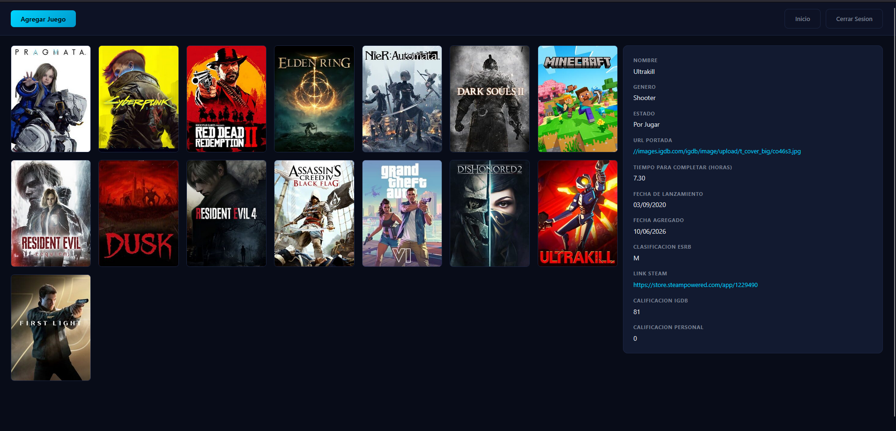

# Backlog

### Game Library Manager with IGDB integration

School project made to learn PHP, the project uses basic JWT authentication, the backend uses a IGDB proxy to communicate with the API, the styling was made with a free AI agent just to learn how to use one, the backend and the UX was made without it.

